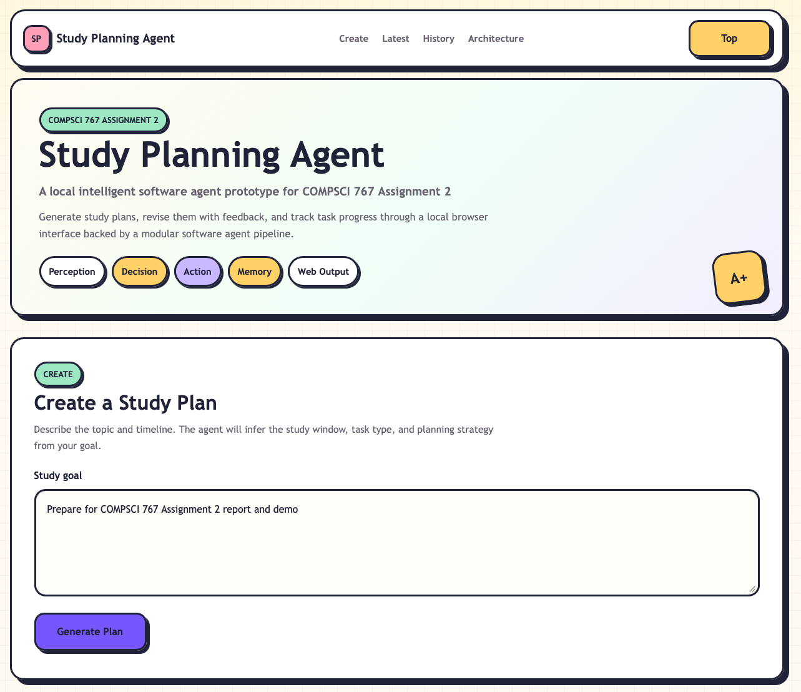
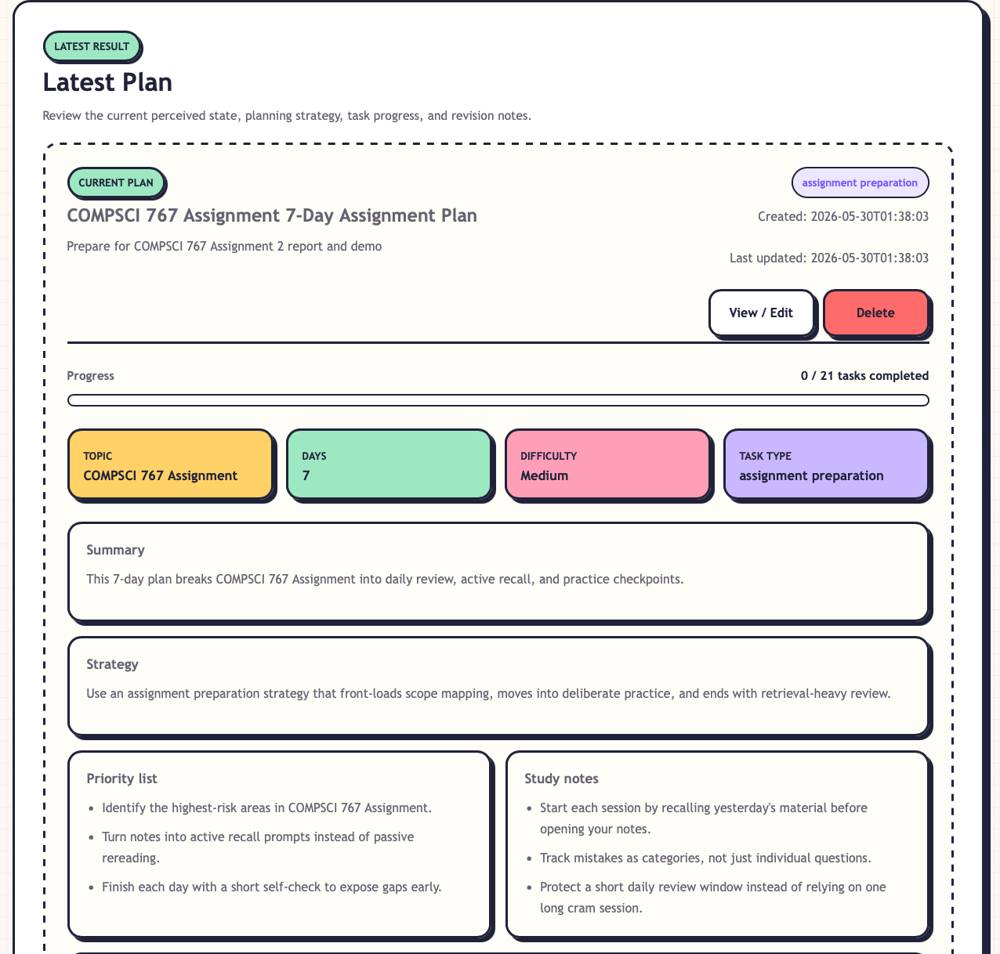
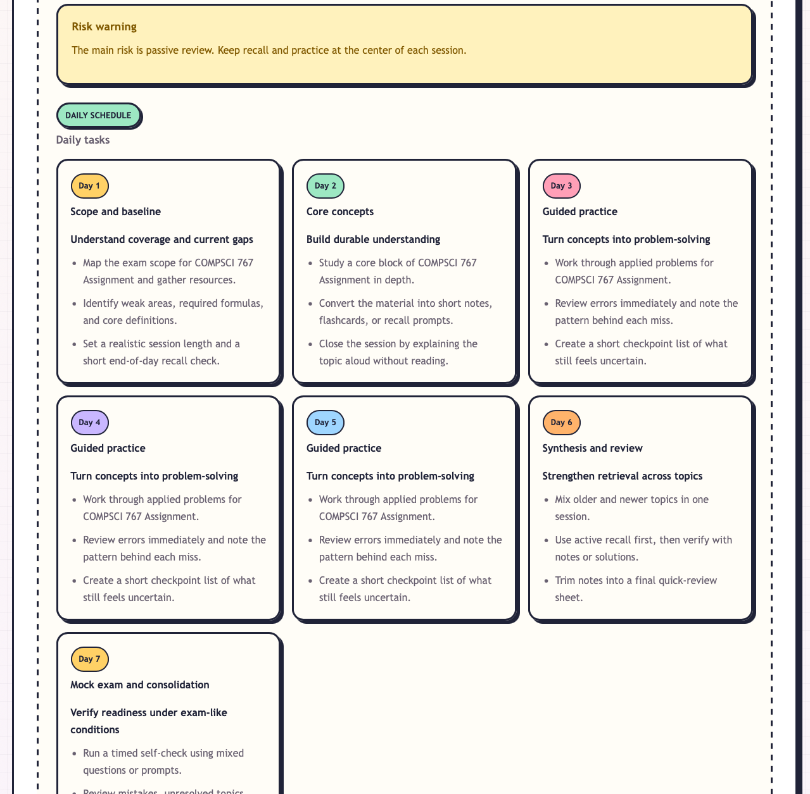
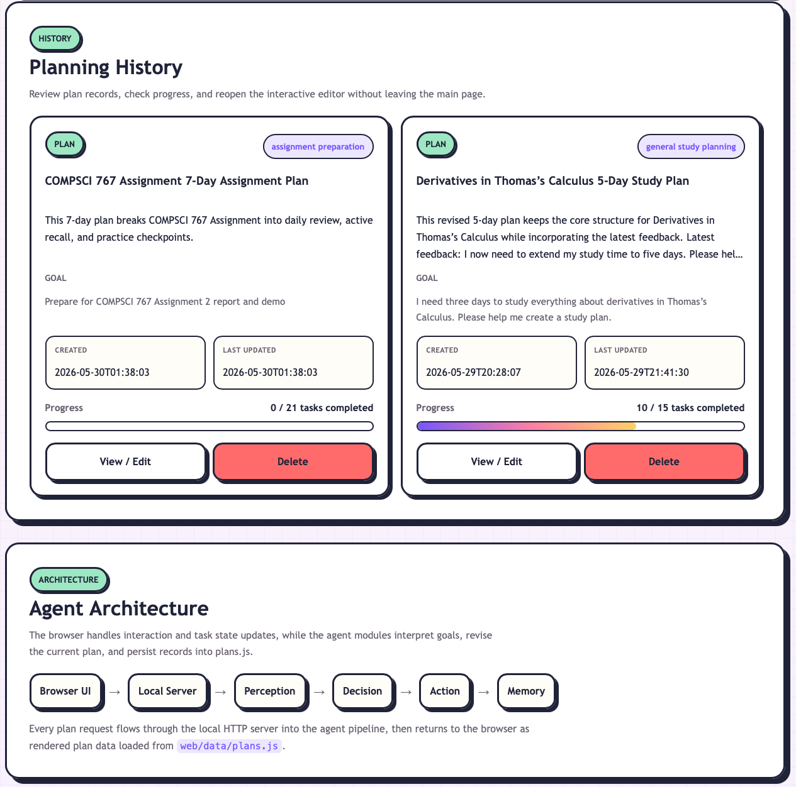

# Study Planning Agent: Local Intelligent Software Agent Prototype

GitHub repository: https://github.com/Leth3323/A-local-intelligent-software-agent-prototype-for-COMPSCI-767-Assignment-2

## Project Overview

Study Planning Agent is a local intelligent software agent prototype for COMPSCI 767 Assignment 2. It works as a personal task and study planning agent: the user enters a natural-language study goal, and the system converts it into a structured plan with a title, topic, duration, difficulty, task type, summary, strategy, priorities, study notes, and daily tasks. The browser prototype stores plans locally and supports viewing, editing, deleting, feedback-based updates, and task statuses such as `To Do`, `In Progress`, and `Done`.

## System Design

```text
Browser UI
  -> Local HTTP Server
  -> StudyPlanningAgent
  -> PerceptionModule
  -> DecisionModule
  -> ActionModule
  -> MemoryModule
  -> Local plan store
  -> Browser UI update
```

The system is organised as a modular intelligent-agent pipeline. The browser collects goals and feedback, while the local Python server coordinates the agent. `PerceptionModule` extracts the topic, time window, difficulty, and task type. `DecisionModule` creates the plan and schedule. `ActionModule` packages plan records and preserves task status during updates. `MemoryModule` saves plans and progress locally so the planning history remains available.

## How the System Works

First, the user enters a natural-language goal, such as preparing for a calculus topic over several days. The agent analyses the goal, generates a practical schedule, and displays the latest plan with progress, daily tasks, priorities, notes, and risk warnings. The user can open the detail view, update task statuses, delete plans, or provide feedback such as extending the timeline. The revised plan is saved locally and shown in history.

## Screenshots



Figure 1. Home page and goal input interface. The user enters a natural-language study goal, and the agent receives this input as the starting point for plan generation.



Figure 2. Generated plan overview. The agent analyses the user goal and converts it into a structured study plan, including a concise title, topic, duration, difficulty level, task type, summary, strategy, priorities, and study notes.



Figure 3. Daily task schedule. The agent breaks the goal into actionable daily tasks, showing how the planning output is organised into smaller steps for the user to follow.



Figure 4. Planning history and agent architecture. The system stores previous plans, tracks task progress, supports view/edit and delete actions, and presents the agent workflow from browser input to perception, decision, action, and memory.

## Conclusion

The project demonstrates a complete local intelligent agent prototype with a clear perception-decision-action-memory structure. It turns informal user goals into actionable plans and supports ongoing interaction through local storage, task progress updates, and feedback-based plan revision.
